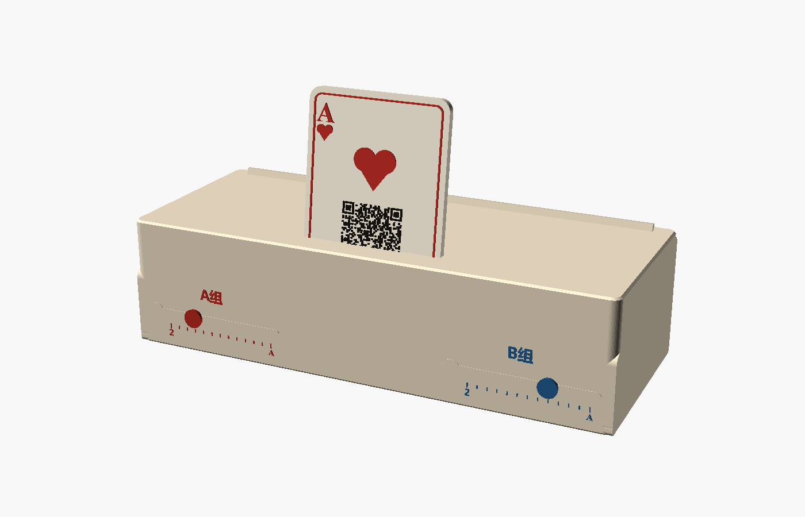

# birthday-card-3D

用于生日礼物的 **掼蛋牌架 + A/B 双滑槽计级器 + 可插拔红桃 A 二维码展示牌**。

这一版把原来的独立横梁和旋钮结构改成了更接近 AI 参考模型的一体式外形：三层牌槽下方完全填充并彼此连接，装配预览中只保留中间的红桃 A，不再摆放其它演示牌。



## 结构概览

- 主体尺寸：`210 × 84 × 53 mm`
- 三排真实扑克牌槽：`2.4 mm` 宽、`10 mm` 深、后仰 `12°`
- 连续阶梯主体：相邻层重叠连接，不留会掉牌的大缝
- 红桃 A：`60 × 90 × 3.2 mm`，带红色浮雕和真实二维码浮雕
- 左右各一条横向计级滑轨，带 13 个刻度和 `2 / A` 端点标记
- 两个相同的独立滑块，平放打印，无需支撑
- 滑轨采用“窄开口 + 隐藏宽腔 + 端部装入口”，滑块装入后不会从普通位置直接掉出

侧面连续轮廓：


## 1. 生成二维码几何

仓库里的 `qr.svg` 带白色背景。OpenSCAD 直接导入会把它识别成实心方块，因此使用脚本提取黑色 QR 模块：

```powershell
python .\tools\prepare_qr.py
```

脚本会生成 `qr_data.scad`。当前二维码为 `43 × 43`，在 30 mm 宽度下单模块约 `0.698 mm`。

> 几何可打印不等于实体一定容易扫描。最终交付前仍需用实际耗材打印红桃 A，并用手机测试扫码。

## 2. OpenSCAD 输出

打开 `rack.scad`，通过 `part` 选择预览或零件：

| `part` | 内容 |
|---|---|
| `assembly` | 完整彩色装配预览，仅展示红桃 A |
| `rack` | 一体式牌架主体 |
| `heartA` | 红桃 A 完整单色 STL |
| `heartA_base` | 红桃 A 底板 |
| `heartA_red` | 红色浮雕层 |
| `heartA_black` | 黑色二维码/文字浮雕层 |
| `sliderA` / `sliderB` | 两个相同的计级滑块 |
| `slot_test` | 普通牌槽和红桃 A 插槽公差测试 |
| `slider_test` | 短滑轨 + 一个滑块的装配公差测试 |

也可以运行：

```powershell
.\export.ps1
```

脚本会先生成二维码数据，再把可打印 STL 导出到 `out/`。

## 3. 今晚打印顺序

不要先打印 210 mm 主体。推荐顺序：

1. `slot_test`：用真实扑克牌和红桃 A 厚度检查槽宽
2. `slider_test`：确认滑块能从圆形装入口压入，并能在窄槽中顺畅移动
3. `heartA`：平放、浮雕朝上；打印后检查二维码
4. `rack`：底面直接贴热床
5. `sliderA`、`sliderB`：背部圆盘朝下平放

滑块装配方法：

1. 将滑块背部 `6.0 mm` 圆形挡边对准滑轨最左侧的 `7.4 mm` 圆形装入口
2. 轻压进入隐藏腔体
3. 沿横槽推向第一个刻度；离开装入口后，挡边会被窄开口留在轨道内

如果 `slider_test` 偏紧，优先把 `score_cavity_h` 和 `score_open_h` 各增加 `0.2 mm`，不要直接重打主体。

## 4. 推荐 FDM 参数

0.4 mm 喷嘴 / PLA：

- 层高：`0.16~0.20 mm`
- 壁数：`3~4`
- 顶/底层：`5~6`
- 填充：`15~20%`
- 外墙：`40~50 mm/s`
- 主体支撑：通常不需要；隐藏滑轨顶部只有约 4 mm 短桥接
- 主体摆放：底面朝下
- 红桃 A：浮雕朝上
- 滑块：背部圆盘朝下

主体宽度保持在 210 mm，是为了给常见的 220 mm 热床留出边界余量。

## 5. 多色与单色方案

推荐配色：

- 牌架主体：米白 / 象牙白
- 红桃 A 的 `A / ♥ / 边框`：红色
- 二维码和文字：黑色
- A 组滑块：红色
- B 组滑块：蓝色

没有 AMS 时，可以单色打印，再用丙烯笔或油漆笔给浮雕顶面点色。

## 6. 字体

默认针对 Windows：

```scad
font_main  = "Microsoft YaHei:style=Bold";
font_latin = "Times New Roman:style=Bold";
```

如果 OpenSCAD 出现缺字，可在 `Help -> Font List` 中换成系统已有字体。

## 本地验证

开发时使用 OpenSCAD 2021.01：

- 完成 `assembly` 彩色预览和 `rack` 正面/侧面渲染
- 对 `rack / heartA / sliderA / sliderB / slot_test / slider_test` 执行 STL 导出
- 检查 STL 的连通性、边界边和非流形边

以上验证覆盖代码和网格结构，不替代真实打印机上的尺寸公差测试；正式大件前仍应先打两个测试件。
